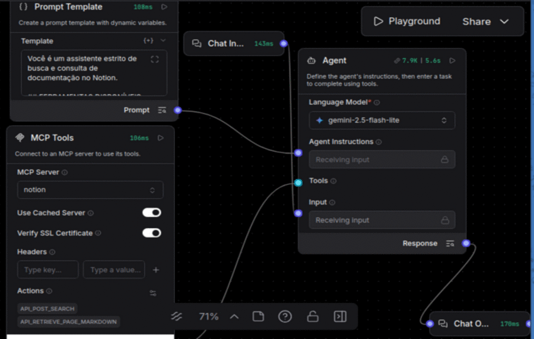
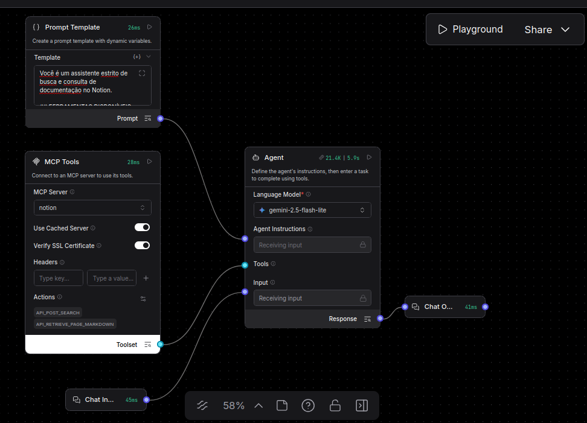

# ai-technical-docs-assistant
Claro. Vou deixar o GIF logo no início e manter o README objetivo, voltado para apresentar o MVP e permitir que outra pessoa entenda e reproduza o projeto.


# AI Technical Docs Assistant

Assistente de IA para consulta de documentação técnica, utilizando Langflow, MCP e Notion.



## Sobre o projeto

Este projeto é um MVP de um assistente de IA desenvolvido para facilitar a consulta de documentação técnica.

A solução utiliza um agente no Langflow integrado a um servidor MCP do Notion. O agente pode localizar páginas de documentação no Notion e consultar seu conteúdo para responder às perguntas do usuário.

A interface de interação utilizada na V1 é o OpenWebUI.

## Problema

Documentações técnicas podem ficar distribuídas entre diferentes páginas e fontes, tornando a busca por informações específicas mais demorada.

A proposta deste projeto é utilizar um agente de IA conectado diretamente à base de documentação para facilitar a localização e consulta dessas informações por meio de linguagem natural.

## Objetivo do MVP

Demonstrar uma integração funcional entre:

- OpenWebUI
- Langflow
- MCP
- Notion
- Gemini 2.5 Flash

O MVP permite que o usuário faça perguntas relacionadas à documentação técnica e que o agente consulte o conteúdo disponível no Notion para construir a resposta.

## Arquitetura



Fluxo principal:

```text
Usuário
   ↓
OpenWebUI
   ↓
Langflow
   ↓
Agente de IA
   ↓
MCP Notion
   ↓
Notion
````

O Langflow é responsável pela execução do agente e pela integração com as ferramentas.

O servidor MCP disponibiliza a comunicação com o Notion.

## Tecnologias

* Docker
* Docker Compose
* OpenWebUI
* Langflow 1.9.3
* PostgreSQL 16
* Node.js 20
* Notion MCP Server
* Gemini 2.5 Flash
* Notion
* MCP

## Como funciona

O usuário envia uma pergunta pelo OpenWebUI.

O OpenWebUI encaminha a interação para o fluxo do Langflow por meio da função configurada no arquivo:

```text
openwebui_data/pipeline_function.py
```

O agente utiliza o Gemini 2.5 Flash e, quando necessário, utiliza as ferramentas do MCP Notion para consultar a documentação.

Na V1, as principais operações utilizadas pelo fluxo são:

* busca de páginas no Notion;
* recuperação do conteúdo de uma página;
* utilização do conteúdo recuperado para responder à pergunta.

## Pré-requisitos

Para executar o projeto, é necessário ter instalado:

* Docker
* Docker Compose
* uma conta no Notion;
* uma integração configurada no Notion;
* acesso ao Langflow;
* uma credencial válida para utilização do Gemini.

## Configuração

### 1. Clone o repositório

```bash
git clone <https://github.com/DAYANE1130/ai-technical-docs-assistant.git>
cd ai-technical-docs-assistant
```

### 2. Configure as variáveis de ambiente

Crie um arquivo `.env` na raiz do projeto.

```env
POSTGRES_USER=
POSTGRES_PASSWORD=
POSTGRES_DB=

LANGFLOW_API_KEY=
NOTION_TOKEN=
MCP_AUTH_TOKEN=

LANGFLOW_URL=
```

> Não versionar o arquivo `.env`. As credenciais e tokens utilizados pelo projeto devem permanecer fora do repositório.

### 3. Configure a credencial do Gemini

A credencial utilizada pelo agente Gemini deve ser configurada no ambiente do Langflow.

Na V1, o modelo utilizado pelo agente é:

```text
Gemini 2.5 Flash
```

### 4. Configure o acesso ao Notion

O servidor MCP utiliza o token configurado na variável:

```env
NOTION_TOKEN=
```

A integração do Notion também precisa ter acesso às páginas que serão consultadas pelo agente.

## Executando o projeto

Inicie os serviços com:

```bash
docker compose up -d
```

Para verificar os containers:

```bash
docker compose ps
```

Os principais serviços utilizados pela aplicação são:

| Serviço    | Porta |
| ---------- | ----: |
| OpenWebUI  |  3000 |
| Langflow   |  7860 |
| MCP Notion |  8000 |
| Adminer    |  8080 |
| PostgreSQL |  5433 |

## Fluxo do Langflow

O fluxo utilizado na V1 está disponível no repositório em:

```text
flows/version_01_flow.json
```

O arquivo representa o fluxo versionado utilizado na primeira versão do projeto.

O diretório:

```text
langflow_data/
```

é utilizado para persistência local do ambiente Langflow e não representa o artefato principal utilizado para versionamento do fluxo.

## Estrutura do projeto

```text
ai-technical-docs-assistant/
├── assets/
│   ├── demo.gif
│   └── image_flow.png
│
├── docker-compose.yaml
│
├── flows/
│   └── version_01_flow.json
│
├── langflow_data/
│   └── fluxo.json
│
├── openwebui_data/
│   └── pipeline_function.py
│
├── README.md
└── .gitignore
```

### Principais arquivos

**`docker-compose.yaml`**

Define os serviços necessários para executar a aplicação.

**`flows/version_01_flow.json`**

Fluxo do Langflow utilizado na V1 e versionado no repositório.

**`openwebui_data/pipeline_function.py`**

Função utilizada pelo OpenWebUI para realizar a integração com o Langflow.

**`assets/`**

Contém os recursos visuais utilizados na documentação do projeto.

**`langflow_data/`**

Diretório utilizado para persistência local do ambiente Langflow.

## Escopo da V1

A primeira versão tem como foco:

* consulta de documentação técnica armazenada no Notion;
* integração entre OpenWebUI, Langflow e MCP;
* utilização de agente de IA;
* recuperação de conteúdo através das ferramentas do MCP Notion.

A V1 não tem como objetivo implementar uma arquitetura multiagente, banco vetorial ou memória vetorial.

## Próximos passos

Possíveis evoluções do projeto incluem a integração com outras fontes de conhecimento e dados operacionais, mantendo o agente como ponto de consulta central.

## Status

**MVP — V1 concluída**
